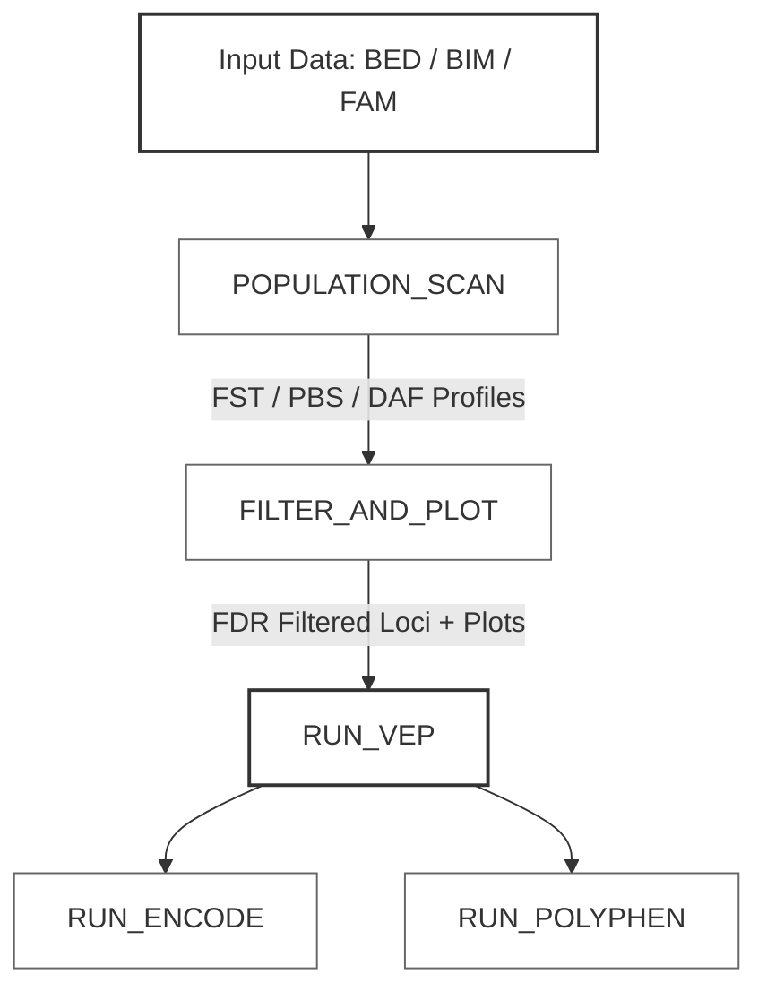

<h1 align="center">🧬 PBS Population Genomics Pipeline</h1>

<p align="center">
  A scalable, reproducible Nextflow DSL2 pipeline for genome-wide selection scans, statistical filtering, and multi-layered functional annotation of candidate loci.
</p>

<p align="center">
  
  
  
  
</p>

---

## 📌 Overview

This pipeline provides an automated, end-to-end framework for detecting signatures of positive natural selection and annotating candidate genomic regions using multi-layer functional evidence. By leveraging **Nextflow DSL2**, the workflow ensures absolute reproducibility, containerization readiness, and seamless scaling from local machines to high-performance computing (HPC) clusters.

### Key Features
* **Multi-Metric Selection Scans:** Joint estimation of allele frequency dynamics and genetic differentiation.
* **Rigorous Error Control:** Multiple testing correction to minimize false-positive variant selection.
* **Layered Annotation:** Simultaneous evaluation of coding consequences, regulatory landscapes, and protein structural impacts.
* **Optimized Parallelization:** Forked asynchronous execution of downstream annotations to maximize CPU utilization.

---

## 🧭 Workflow Architecture

The pipeline processes population genetic data through three decoupled phases: scanning, filtering/visualization, and parallelized functional characterization.



---

## 🧪 Methodological Components

### 1. Population Genomic Scanning

* **Fixation Index ($F_{\text{ST}}$):** Evaluates genetic differentiation between defined sub-populations.
* **Population Branch Statistic ($PBS$):** Quantifies line-specific allele frequency shifts relative to a tri-population tree, isolating locus-specific positive selection.
* **Derived Allele Frequency ($DAF$):** Profiles ancestral vs. derived allele spectrums to track selective sweeps.

### 2. Statistical Filtering

* **False Discovery Rate ($FDR$):** Applies Benjamini-Hochberg corrections to control for Type I errors across millions of genomic windows.
* **Significance Thresholding:** Automatically isolates extreme outlier loci based on empirical distribution cutoffs.

### 3. Functional Annotation

* **Ensembl Variant Effect Predictor (VEP):** Determines transcript-level consequences (missense, synonymous, splice-site disruptions).
* **ENCODE Regulatory Mapping:** Overlays chromatin accessibility (DNase-seq) and histone modification peaks to flag non-coding regulatory candidates.
* **PolyPhen-2 / SIFT:** Predicts the structural and functional neutrality of amino acid substitutions in protein-coding regions.

---

## 📂 Repository Structure

```text
GenomicPipeline/
├── main.nf                 # Main Nextflow DSL2 workflow logic
├── nextflow.config         # Global execution and profile configurations
├── scripts/                # Modular Python analysis engines
│   ├── fst_daf_admixture.py
│   ├── pbs.py
│   ├── filtering_fdr.py
│   ├── plotting.py
│   ├── VEP.py
│   ├── ENCODE.py
│   └── PolyPhen.py
├── results/                # Local pipeline output directory (git-ignored)
└── README.md

```

---

## ⚙️ Requirements & Environment

* **Nextflow:** Version 22.10.0+ (DSL2 enabled)
* **Conda Environment:** Pre-configured `selscan_env` containing:
* Python 3.x
* Core data science libraries (`numpy`, `pandas`, `matplotlib`, `seaborn`)
* Specialized bioinformatic tools compatible with PLINK binary formats.


> 💡 **Note:** Ensure your Conda environment is activated or properly pathed within the `nextflow.config` file prior to execution.

---

## ▶️ Usage

### 1. Run with default parameters

To execute the pipeline using your default configurations, use:

```bash
nextflow run main.nf -resume

```

### 2. Custom execution example

You can override default parameters directly via the CLI:

```bash
nextflow run main.nf \
  --input "data/my_study" \
  --outdir "results_v1" \
  --fdr_alpha 0.05 \
  -profile conda

```

| Parameter | Type | Description |
| --- | --- | --- |
| `-resume` | Flag | Caches successful steps; resumes only modified or failed processes. |
| `--input` | String | Base path to PLINK binary filesets (`.bed`, `.bim`, `.fam`). |
| `--fdr_alpha` | Float | Significance threshold for false discovery rate filtering. |

---

## 📤 Outputs

All generated files are structured into the `results/` directory upon successful pipeline completion:

| Directory | Output Type | Description |
| --- | --- | --- |
| `📂 01_scans/` | Tabular (`.tsv`) | Raw locus-by-locus metrics for $F_{\text{ST}}$, $PBS$, and $DAF$. |
| `📂 02_filtered/` | Tabular & Visual | High-confidence candidate loci alongside genome-wide Manhattan plots. |
| `📂 03_annotations/` | Combined Reports | Integrated functional datasets containing VEP impacts, ENCODE links, and PolyPhen scores. |

---

## 🧠 Scientific Context

This architecture is optimized for evolutionary genetics workflows searching for adaptive variants. By coupling raw population genetic metrics with regulatory and structural impact predictions, it bridges the gap between purely statistical outliers and biologically verifiable functional variants.

---

## 👨‍🔬 Author

**Ammar Mizwar Bin Abdul Rashid**

BSc Microbiology & Molecular Genetics

*University of Malaya*

---

## 📜 License

This project is intended for academic and research purposes. Please cite the repository if used in published works.

```
